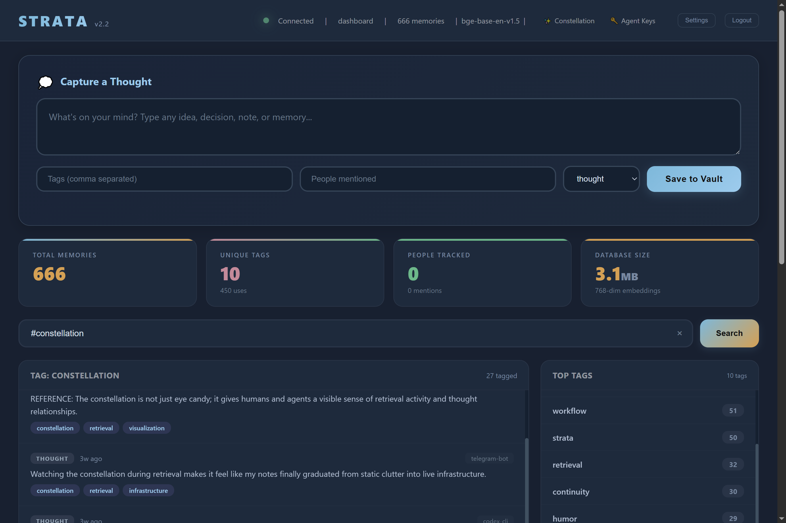
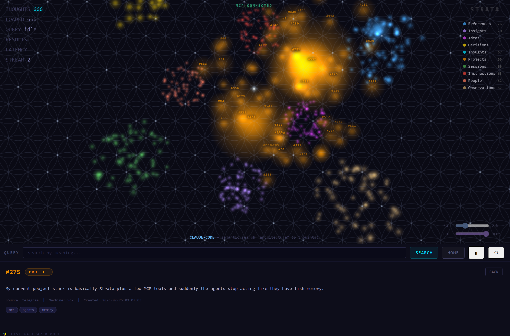

# STRATA v2.2

Self-hosted AI memory server. Your thoughts, your hardware, your data.

## Why Strata?

Your AI forgets everything the moment the session ends. Strata fixes that. It gives any MCP-compatible AI a persistent memory that lives on YOUR hardware - not in the cloud, not on someone else's server. Search by meaning, attach real files, and run it all on a Raspberry Pi.






## What's new in v2.2

v2.0 taught Strata who's talking. v2.2 teaches it to scale, audit, and remember your past.

- **Per-agent API keys** - every AI agent gets its own key with granular `read / write / delete / admin / kill` permissions. You stop sharing one key across every tool. Manage them from `/admin/agents`.
- **Free-tier hard lock** - run up to 3 active agents at once on the free tier. Create as many as you want (up to 10), but only 3 can be enabled simultaneously. Paid licenses raise the cap via env var.
- **Global MCP kill switch** - one toggle that locks every agent out of MCP, REST, and `/api/*`. Any agent with write or kill permission can pull the brake; only a human admin can flip it back on. Built for the moment a tool goes rogue.
- **3D Constellation viewer** - watch your brain think in real time at `/constellation`. Sacred-geometry layout (Flower of Life background, dodecahedron clusters, Fibonacci sphere distribution), per-agent colors, live activity stream, and a kill-switch indicator that desaturates the whole scene when MCP is offline.
- **Per-agent identity colors** - each agent gets a color from a curated palette, editable from the admin panel. Colors flow through the constellation viewer so you can tell at a glance which agent is doing what.
- **Encryption at rest (optional)** - SQLCipher AES-256 encryption with key in a root-only file. Dormant by default; flip on with one env var and a setup script when your threat model needs it.
- **File-level hardening (optional)** - dedicated `strata` system user owns the database with mode 600. SSH users can no longer bypass the API by editing the SQLite file directly.
- **Demo mode** - run a public demo with `STRATA_DEMO_MODE=true` and the dashboard accepts blank passwords (the login screen still renders so visitors can see the auth feature exists).

**New in v2.2:**

- **PostgreSQL + pgvector backend** — SQLite is still the default for quick demos, but set `STRATA_DB_BACKEND=postgresql` for production. PostgreSQL handles concurrent multi-agent writes natively (no more write queue), and pgvector does similarity search IN the database with HNSW indexes. Scales to 1 million+ thoughts.
- **CSV audit log** — every agent action is logged to daily CSV files in `data/audit/`. Full replay tape: who searched what, which thoughts came back, how long it took. This is the transparency layer — trace exactly how an AI built its understanding of your data. View via `GET /api/audit`.
- **Pre-Strata history (negative IDs)** — import your memories from BEFORE you installed Strata using `capture_legacy`. These get negative IDs (-1, -2, -3...) and live in the same constellation alongside your current thoughts. Your AI memory doesn't start at install day — it reaches back as far as you want. Click "THOUGHTS" in the constellation viewer to toggle between current and historical views.
- **10 thought types** — expanded from 8 types with clear descriptions that teach AI agents WHEN to use each one. Added `idea` (brainstorms, not yet decided) and `observation` (patterns noticed, no conclusions drawn). The agent protocol now spells out type selection so every new user's constellation is balanced.
- **Updated agent protocol** — `strata_status` now teaches agents about all 10 types, negative ID history, the audit log, and outcome loop tracking. No CLAUDE.md needed — the protocol IS the onboarding.
- **Constellation camera fix** — clicking a star flies the camera past it and looks back, keeping the origin star visible in the background as an anchor.
- **Demo mode improvements** — agent creation and MCP kill switch now work without an admin key in demo mode.

Plus the v1 features you already know: semantic search, file vault, dedup protection, password+seed-phrase dashboard auth, dark theme, runs on a Pi.

I built this because I got tired of my AI tools forgetting everything between sessions. STRATA gives any MCP-compatible AI (Claude Code, Codex CLI, whatever comes next) a persistent brain that lives on YOUR machine. Not in the cloud. Not on someone else's server. Yours.

It runs on a Raspberry Pi 4B. Seriously. The whole thing - semantic search, file storage, embeddings - runs on a $55 computer with 4GB of RAM.

## What it does

- **Search by meaning** - ask for "money stuff" and it finds your notes about Bitcoin, investments, and budgets. Not keyword matching. Actual understanding.
- **File vault** - attach real files to your thoughts. Code, documents, project archives. The thought is your index, the vault holds the goods.
- **Auto-tagging** - write about Docker? It tags it. Mention a URL? Tagged. You don't have to organize anything manually.
- **Dedup protection** - tries to save something you already saved? It catches it and warns you.
- **Access tracking** - see which memories actually get used vs which ones just sit there.
- **Admin-only deletion** - AI can read and write memories, but it CANNOT delete anything without your explicit admin key. Your data, your control.

## Why I built it this way

Regular databases search by keywords. If you stored "switching careers" but search for "new job", you get nothing.

STRATA converts every thought into a 768-dimensional vector that captures what it *means*. Similar ideas land near each other in that vector space. So "switching careers" and "new job" and "career change" all find each other.

The model runs locally through ONNX Runtime (not PyTorch - that thing eats 1.5GB just to import on ARM). Total RAM for the embedding model is about 100-150MB, and it unloads after 5 minutes of idle time.

## The file vault

This is what makes STRATA more than a note-taking app.

You capture a thought about a project. Then you attach the actual source files to it. Later, when you or your AI searches for that topic, you get the thought AND a list of every file attached to it. The AI picks which files it needs and pulls just those - it doesn't load your whole drive into memory.

Files are organized on disk like this:
```
data/vault/
  my-laptop/
    2026-03/
      42/
        server.py
        config.py
  my-desktop/
    2026-03/
      55/
        training_data.csv
```

Organized by device and month. You can browse it manually if you want. Files up to 1GB, text files capped at 5MB when returned to AI (so it doesn't blow up the context window).


## Pre-Strata history (negative IDs)

Your AI memory doesn't have to start at install day. Import your past:

```python
# Via MCP tool
capture_legacy(
    content="Decided to self-host everything after the cloud bill hit $400/mo",
    thought_type="decision",
    tags=["infrastructure", "self-hosting"],
    original_date="2024-06-15",
    source="pre-strata"
)
```

Legacy thoughts get negative IDs (-1, -2, -3...) while live thoughts use positive IDs. Both are fully searchable — they live in the same vector space. The constellation viewer has a toggle: click "THOUGHTS" to dim current stars and highlight your history.


## CSV audit log

Every agent interaction is logged to daily CSV files in `data/audit/`:

```
data/audit/
  audit_2026-04-19.csv
  audit_2026-04-20.csv
  ...
```

Each row records:
- **timestamp** — when the operation completed (UTC)
- **agent_name** — which agent made the call
- **agent_key_hint** — masked API key (enough to identify, not enough to use)
- **action** — what happened (capture_thought, semantic_search, etc.)
- **detail** — search query or content preview
- **thought_ids** — which thoughts were touched
- **result_count** — how many results came back
- **response_ms** — operation duration

Query today's log via REST: `GET /api/audit?limit=50`

Override the directory: `STRATA_AUDIT_DIR=/your/path`
Disable entirely: `STRATA_AUDIT_ENABLED=false`


## PostgreSQL backend (production)

SQLite works great for getting started and single-user setups. For production with multiple agents hitting Strata simultaneously, switch to PostgreSQL:

```bash
# Install PostgreSQL 17 + pgvector
sudo apt install postgresql-17 postgresql-17-pgvector

# Create the database and user
sudo -u postgres createuser strata
sudo -u postgres createdb strata_db -O strata
sudo -u postgres psql -c "ALTER USER strata PASSWORD 'your-password-here';"

# Run the schema (creates tables, indexes, triggers)
sudo -u postgres psql -d strata_db -f strata_pg_schema.sql

# Set the backend
export STRATA_DB_BACKEND=postgresql
export STRATA_PG_PASSWORD=your-password-here

# Start Strata — it auto-detects the backend
python server.py
```

### Migrating from SQLite to PostgreSQL

If you already have thoughts in SQLite:

```bash
python migrate_to_pg.py
```

This migrates all thoughts, embeddings, history, agent keys, and profiles. Your SQLite database is preserved as a backup.

### Why PostgreSQL?

| Feature | SQLite | PostgreSQL |
|---------|--------|------------|
| Concurrent writers | 1 (write queue) | Unlimited |
| Similarity search | numpy in Python | pgvector HNSW in-database |
| Full-text search | FTS5 | tsvector (weighted) |
| Scale target | < 10K thoughts | 1M+ thoughts |
| Setup complexity | Zero | Moderate |

## Try the demo first (60 seconds, no setup)

The repo ships with a **pre-populated demo database**: 666 curated thoughts about Strata itself, 3 sample agents with palette colors, ready to explore. No mining, no seed data hunt, no thinking about what to capture first — just clone, drop the demo DB into place, and see the constellation populated.

```bash
git clone https://github.com/agenerationforwordz-tech/strata.git
cd strata

python -m venv venv
source venv/bin/activate     # Windows: venv\Scripts\activate
pip install -r requirements.txt

# Drop the curated demo dataset into place
mkdir -p data
cp demo/strata.db data/strata.db

# Run with demo mode so blank passwords work for visitors
STRATA_DEMO_MODE=true python server.py
```

> ⏱️ **First install takes 5–15 minutes.** `pip install -r requirements.txt` downloads about **700 MB** of binary wheels for the embedding model runtime (`fastembed`, `onnxruntime`, `numpy`, `transformers` tokenizer support). **Don't kill the install if it appears stuck** — it's downloading binaries in the background. Subsequent installs reuse the venv and take seconds. Run with `pip install -r requirements.txt --progress-bar on` if you want to watch the byte count tick up.

Open these in your browser:

| URL | What you see |
|---|---|
| `http://localhost:4320/dashboard` | Web dashboard — login with **blank password** (demo mode) |
| `http://localhost:4320/constellation` | 3D constellation viewer with all 666 thoughts laid out in sacred-geometry clusters |
| `http://localhost:4320/admin/agents` | Per-agent key management with the 3 sample agents (all disabled by default — enable one or create your own to start using Strata) |

See [`demo/README.md`](demo/README.md) for the full demo dataset details, including how to regenerate your own.

### Windows install notes

A few Windows-specific gotchas worth knowing about:

- **Git "dubious ownership" error on the D: drive.** If you clone Strata to `D:\` or any non-system drive, Git may refuse to operate on the repo with `fatal: detected dubious ownership in repository`. Fix:
  ```powershell
  git config --global --add safe.directory 'D:/Claude Code Projects/strata'
  ```
  (Replace the path with wherever you cloned.)
- **PowerShell env vars use `$env:`, not `export`.** To set the demo-mode flag and run:
  ```powershell
  $env:STRATA_DEMO_MODE = "true"
  python server.py
  ```
  For persistent env vars across sessions:
  ```powershell
  [System.Environment]::SetEnvironmentVariable('STRATA_DEMO_MODE','true','User')
  ```
- **Stale `pip` processes can hold file locks** in the venv during a long install. If you cancel an install and re-run it and get permission errors, kill any leftover python.exe processes via Task Manager or `Stop-Process -Name python -Force` and try again.

## Getting started (real install, no demo data)

```bash
git clone https://github.com/agenerationforwordz-tech/strata.git
cd strata

python -m venv venv
source venv/bin/activate  # Linux/macOS
# or: venv\Scripts\activate  # Windows

pip install -r requirements.txt

# Optional: legacy fallback admin key for delete operations.
# In v2, every agent has its own key issued from /admin/agents,
# but this admin key is required for destructive operations.
export STRATA_ADMIN_KEY="different-key-for-delete-ops"

python server.py
```

> ⏱️ Same first-install warning as above — `pip install -r requirements.txt` is downloading ~700 MB of binary wheels for the embedding model runtime. Plan for 5–15 minutes on first install.

After the server starts, open `http://localhost:4320/admin/agents` to register your first agent. Per-agent keys are how AI clients connect — see the "Connecting your AI" section below.

Server runs at `http://0.0.0.0:4320`.

## Connecting your AI

First, register the agent at `http://your-server:4320/admin/agents` and copy its key. Each agent should have its own key — that's how the per-agent permissions, identity colors, and audit trail work.

### Claude Code — one-command install (recommended)

Strata ships as a Claude Code plugin. Add the marketplace once, then install:

```bash
claude plugin marketplace add agenerationforwordz-tech/strata-plugins
claude plugin install strata@strata-plugins
```

During install you'll be prompted for two things:
- **`strata_url`** — e.g. `http://localhost:4320/mcp` for a local install
- **`strata_api_key`** — the agent key you copied from `/admin/agents`

Restart Claude Code and your AI has persistent memory across every session.

### Claude Code — manual MCP config (older versions)

```bash
claude mcp add --transport http strata http://your-server-ip:4320/mcp \
  --header "X-API-Key: agent-your-key-here"
```

Or add to `~/.claude/settings.json`:
```json
{
  "mcpServers": {
    "strata": {
      "url": "http://your-server-ip:4320/mcp",
      "headers": {
        "X-API-Key": "agent-your-key-here"
      }
    }
  }
}
```

### Codex CLI

Codex CLI's MCP config lives in `~/.codex/config.toml` (Windows: `C:\Users\<you>\.codex\config.toml`). Add this block:

```toml
[mcp_servers.strata]
url = "http://your-server-ip:4320/mcp"
env_http_headers = { "X-API-Key" = "STRATA_CODEX_API_KEY" }
startup_timeout_sec = 15.0
tool_timeout_sec = 60
```

Then set the env var that the `env_http_headers` line references — Codex resolves it at startup, not at config-load time:

**Linux/macOS:**
```bash
export STRATA_CODEX_API_KEY="agent-your-codex-key-here"
```

**Windows (persistent across sessions):**
```powershell
[System.Environment]::SetEnvironmentVariable('STRATA_CODEX_API_KEY','agent-your-codex-key-here','User')
```

Verify with:
```bash
codex mcp get strata
```
You should see the entry with `enabled: true`.

> ⚠️ **Known Codex CLI issue (as of v0.120.0 on Windows):** the streamable HTTP transport discovers Strata's tools correctly, but `codex exec` may cancel actual tool calls client-side with `user cancelled MCP tool call`. This appears to be a Codex CLI bug, not a Strata bug — Strata's server logs show `200 OK` on the MCP requests. If you hit this, report it to the Codex CLI repo. The same Strata server works fine with Claude Code, the dashboard, and direct REST calls.

### How your agent learns to use Strata

Every connected agent should call `strata_status` as its first tool call. That tool returns a natural-language protocol that teaches the agent *when* to capture, *when* to search, how to handle the 10 thought types, and how to interpret negative-ID legacy imports. No CLAUDE.md configuration required — the tool teaches itself.

Admins can customize the protocol per-instance by writing to the `system_config['agent_protocol']` row via the dashboard or the REST endpoint:

```bash
curl -X PUT http://your-server:4320/admin/api/protocol \
  -H "X-API-Key: $STRATA_ADMIN_KEY" \
  -H "Content-Type: application/json" \
  -d '{"protocol": "...your custom instructions..."}'
```

Send an empty string to reset to the default.

### Any HTTP client

```bash
# Save a thought
curl -X POST http://your-server:4320/api/capture \
 -H "Content-Type: application/json" \
 -H "X-API-Key: your-key" \
 -d '{"content": "STRATA is running on my Pi!", "tags": ["setup"]}'

# Search by meaning
curl -X POST http://your-server:4320/api/search \
 -H "Content-Type: application/json" \
 -H "X-API-Key: your-key" \
 -d '{"query": "server setup", "limit": 5}'

# Health check (no auth needed)
curl http://your-server:4320/health
```

## Configuration

All in `config.py`. Override with environment variables:

| Variable | Default | What it does |
|----------|---------|-------------|
| `STRATA_API_KEY` | `change-me-before-deploy` | Legacy fallback REST key |
| `STRATA_ADMIN_KEY` | *(empty - disables deletion)* | Required for delete + admin operations |
| `STRATA_HOST` | `0.0.0.0` | Listen address |
| `STRATA_PORT` | `4320` | Server port |
| `STRATA_DATA_DIR` | `./data` | Database location |
| `STRATA_VAULT_DIR` | `./data/vault` | File vault location |
| `STRATA_AUTH_ENABLED` | `true` | Kill switch for auth (don't) |
| `STRATA_MAX_ACTIVE_AGENTS` | `3` | Free-tier hard lock — max simultaneously enabled agents |
| `STRATA_MAX_TOTAL_AGENTS` | `10` | Anti-spam ceiling on total registered agents |
| `STRATA_DEMO_MODE` | *(unset)* | If `true`, dashboard accepts blank passwords (public demos) |
| `STRATA_DB_ENCRYPT` | *(unset)* | If `true`, opens DB via SQLCipher (run `setup_encryption.sh` first) |
| `STRATA_DB_KEY_FILE` | `/etc/strata/db.key` | Path to the SQLCipher key file (root/strata only) |
| `STRATA_IP_AGENTS` | *(empty)* | Comma-separated `IP=name` pairs for legacy IP→agent attribution |

## The tools (21 core + extensions)

### Memory
| Tool | What it does |
|------|-------------|
| `capture_thought` | Save a new memory with auto-tagging and dedup check |
| `semantic_search` | Find memories by meaning |
| `hybrid_search` | Keywords + meaning combined |
| `search_by_tag` | Filter by tag |
| `search_by_person` | Filter by person mentioned |
| `search_advanced` | Stack filters: tag + type + date + machine |
| `get_relevant_context` | Smart search - deduped and grouped by type *(extension)* |
| `find_related` | "More like this" for a specific thought |
| `list_recent` | What got captured recently |
| `get_thought` | View one thought (includes its file attachments) |
| `update_thought` | Edit a thought (re-embeds automatically) |
| `delete_thought` | Remove a thought + vault files (admin key required) |
| `get_stats` | Database stats and vault usage |
| `generate_report` | Trend report - what's rising, what's declining *(extension)* |

### File vault
| Tool | What it does |
|------|-------------|
| `attach_file` | Attach a file to a thought |
| `get_file` | Read an attached file |
| `list_attachments` | See all files on a thought |
| `detach_file` | Remove an attachment (admin key required) |

## Web dashboard

STRATA includes a full web dashboard at `http://your-server:4320/dashboard`. No extra setup needed - first visit walks you through account creation.

### Account system

- **Password-protected** - first visit creates your account with a password (PBKDF2-SHA256, 480K iterations)
- **12-word recovery phrase** - generated during setup like a Bitcoin wallet. Write it down. It's the only way to reset a forgotten password. Stored as a hash, never in plaintext.
- **Device sessions** - each browser gets a named session ("my-laptop", "my-phone"). Names must be unique across devices. Sessions last 7-365 days (you pick).
- **10-day rename cooldown** - device names can only be changed once every 10 days to prevent abuse
- **Settings page** - change password (requires current), view connected devices, rename your device

AI clients (Claude Code, Codex, etc.) still use the API key via `X-API-Key` header. The dashboard auth is a separate system - they don't interfere with each other.

### Dashboard features

- **Capture thoughts** from the browser with tags, people, and type selection
- **Semantic search** - find by meaning, not keywords
- **Tag search** - click any tag to filter all thoughts with that tag. Type `#tagname` in the search bar for the same thing.
- **Infinite scroll** - loads 30 thoughts at a time, fetches more as you scroll
- **Stats cards** - total memories, tag count, people mentioned, database size
- **Trending tags** - rising/declining/new tags with clickable filters
- **Device activity** - animated bars showing which machines contribute the most
- **Hottest memories** - most-accessed thoughts ranked by hit count
- **Dark theme** - warm dark mode, responsive on mobile

## Per-agent API keys

In v1, every AI tool shared one `STRATA_API_KEY`. That worked when "every AI tool" was just you and Claude Code. As soon as you have a Surface laptop, a Helios desktop, a few telegram bots, and a nightly cron job all hitting Strata, you want to know which agent did what — and you want to be able to revoke any one of them without taking the others down.

v2 ships per-agent keys. Open `/admin/agents`, click "Register New Agent", give it a name, and you get a unique key like `agent-G8O1bK2kQiN3F0Haq03e_0kIh5D8YiFo`. The agent uses that key in its `X-API-Key` header — server.py looks it up on every request and checks the granular permission flags.

| Permission | What it gates |
|---|---|
| `enabled` | Master switch — disable an agent without deleting it |
| `can_read` | `semantic_search`, `list_recent`, `get_thought`, etc. |
| `can_write` | `capture_thought`, `update_thought`, attaching files |
| `can_delete` | `delete_thought`, `detach_file` (off by default) |
| `can_admin` | Manage other agents, view audit data |
| `can_kill` | Pull the global MCP kill switch (see below) |

The dedicated human admin key (`STRATA_ADMIN_KEY`) is always separate and never appears in the agent table. It's the master override for the operations no agent should be able to do on its own — re-enabling the kill switch, granting admin to other agents, raising the active-agent cap.

### Free-tier hard lock

Free Strata installs are capped at **3 active agents at once**. You can register up to `STRATA_MAX_TOTAL_AGENTS` (default 10) agents in total, but only 3 of them can have `enabled=1` at any moment. Hit the cap while creating a 4th and the new agent lands `enabled=0` (parked) — flip an existing one off to free a slot, or upgrade.

The cap is enforced at the data-access layer in `agent_keys.py`, so every entrypoint trips over it (admin HTTP API, CLI, future UI, direct module import). Bypassing it requires editing the source and running unlicensed — which is exactly what the [PolyForm Noncommercial license](LICENSE) doesn't permit.

Paid commercial installs raise the cap by setting `STRATA_MAX_ACTIVE_AGENTS` in the server environment. No code change needed.

## Global MCP kill switch

One toggle locks every agent out of MCP, REST, and `/api/*`. Hit it from `/admin/agents` (the big shield panel at the top) or via REST:

```bash
curl -X PUT http://your-server:4320/admin/api/mcp-toggle \
 -H "X-API-Key: your-agent-or-admin-key" \
 -H "Content-Type: application/json" \
 -d '{"enabled": false}'
```

The permission model is asymmetric on purpose:

- **Disable** — any human admin OR any agent with `can_write=1` or `can_kill=1`. This is a safety valve. An agent that detects it's compromised must be able to pull the brake without begging the human for admin rights first.
- **Re-enable** — ONLY the human admin key. An agent that flipped the switch off cannot undo its own decision. The human walks over and flips it back on.

When the kill switch is off, every `/mcp`, `/sse`, and `/api/*` request returns `503 Service Unavailable`. The audit log records who flipped it (`[KILL SWITCH] Global MCP access DISABLED by claude-on-surface`). The constellation viewer reflects the state in real time — see below.

## Constellation viewer

Open `http://your-server:4320/constellation` and watch your brain think. It's a 3D visualization of every thought in your database, distributed across the surface of a Fibonacci sphere with each cluster snapping to the vertices of a dodecahedron. Behind it sits a Flower of Life canvas — barely visible by default, slider-adjustable. Sacred geometry, all the way down.

When an agent searches or captures, the constellation lights up in that agent's color and beams flow from the agent badge to each matching thought. Per-agent colors are stored in the database (editable from the admin panel) so the viewer always reflects current identity.

When the MCP kill switch flips off, the whole scene desaturates to silver-grey, the auto-rotation slows to ~15%, and a centered "MCP DISCONNECTED" overlay appears with the actor name in their identity color. The visual is impossible to miss across the room.

Use it as a wallpaper: `http://your-server:4320/constellation?mode=wallpaper` strips the UI and runs the constellation full-screen.

## Encryption at rest (optional)

By default Strata stores its SQLite database as a plain file. That's fine for personal installs on a NAS you control, but if your threat model includes "someone walks off with the drive" or "a backup leaks", you want the data encrypted at rest.

```bash
sudo ./setup_encryption.sh
```

The script:

1. Installs `sqlcipher` and the `pysqlcipher3` Python binding
2. Generates a 256-bit AES key, saves it to `/etc/strata/db.key` (mode 400, root-only)
3. Migrates your existing database in place via `sqlcipher_export()`
4. Sets `STRATA_DB_ENCRYPT=true` and `STRATA_DB_KEY_FILE=/etc/strata/db.key` in the systemd service

After restart, `db.py` opens the database via `pysqlcipher3` instead of `sqlite3`, and every query runs against AES-encrypted pages. The key never lives in code or environment variables — only in the root-owned file.

**If you lose the key, the database is unrecoverable.** Back it up somewhere safe.

To run unencrypted (the default), do nothing. The encryption code path is dormant unless `STRATA_DB_ENCRYPT=true` is set.

## File-level access hardening (optional)

Even with the API key system, anyone with SSH access to the host could open `strata.db` directly with `sqlite3` and bypass all your auth, rate limits, and audit trails. `setup_secure.sh` closes that hole:

```bash
sudo ./setup_secure.sh
```

The script:

1. Creates a dedicated `strata` system user (no login, no home dir)
2. Sets the data directory ownership to `strata:strata` mode 700
3. Sets every DB file to mode 600 (owner read/write only)
4. Updates the systemd service to run as the `strata` user

After restart, the Strata process can read and write the database, but no other user (including `nacho` or `root` without explicit elevation) can touch the file directly. All access has to go through the API — which means rate limits, auth checks, and audit logs apply uniformly.

## Demo mode

For public demos at conferences, on a tablet at the booth, or on a public-facing URL, you don't want the auth screen to lock visitors out. Set `STRATA_DEMO_MODE=true` in the server environment and:

- The login screen still renders (visitors see that auth exists)
- Blank passwords are accepted on both `/api/auth/setup` and `/api/auth/login`
- The server substitutes a fixed internal placeholder password so the hashing / session / device-name plumbing keeps working

This is **for demos only**. NEVER set it on a real deployment — it removes the authentication barrier entirely.

```bash
STRATA_DEMO_MODE=true python server.py
```

## Running as a service

Create `/etc/systemd/system/strata.service`:

```ini
[Unit]
Description=STRATA Memory Server
After=network.target

[Service]
Type=simple
User=your-user
WorkingDirectory=/path/to/strata
ExecStart=/path/to/strata/venv/bin/python server.py
Environment=STRATA_API_KEY=your-secret-key
Environment=STRATA_ADMIN_KEY=your-admin-key
Environment=STRATA_DATA_DIR=/path/to/your/data
Restart=always
RestartSec=5

[Install]
WantedBy=multi-user.target
```

```bash
sudo systemctl daemon-reload
sudo systemctl enable strata
sudo systemctl start strata
```

## How it's built

```
AI Clients (Claude Code, Codex, bots)          Humans (browser/tablet)
        |                    |                       |
   MCP (/mcp)          REST (/api/*)          Dashboard (/dashboard)
        |                    |                  Constellation (/constellation)
        |                    |                  Admin (/admin/agents)
        |                    |                       |
        +---- MCPKillSwitchMiddleware (rejects all when off) -----+
        |                    |                       |
        +-------- server.py - rate limiting, sanitization --------+
        |                    |                       |
   Per-agent keys      Per-agent keys        Password + session auth
   (X-API-Key)         (X-API-Key)           (auth.py - PBKDF2, seeds)
   agent_keys.py       agent_keys.py         users + sessions tables
        |                    |                       |
   embedder.py          vault.py            activity_stream (SSE)
   ONNX model         file storage          per-agent broadcasts
   on-demand          by device/month                |
        |                    |                       |
              db.py - SQLite (or SQLCipher) + FTS5 + numpy
              thoughts + attachments + users + sessions + agent_keys
```

## Hardware

Built to run on a Raspberry Pi 4B (4GB). Here's what it actually uses:

| What | RAM |
|------|-----|
| Server idle | ~50MB |
| Embedding model loaded | ~100-150MB |
| 10K thoughts | ~30MB for vectors |

Model loads when you need it, unloads after 5 min idle.

### Storage

| What | Disk |
|------|------|
| Python venv (fastembed, numpy, onnxruntime) | ~700MB |
| ONNX model (downloaded on first use) | ~170MB |
| Code + dashboard | ~1MB |
| Database | ~1KB per thought |

A fresh install needs roughly **1GB of disk space**. A 16GB SD card is plenty. The database and file vault grow with usage, so if you plan to attach a lot of files, point the vault at external storage.

Minimum specs: any machine with 2GB RAM, 2GB free disk, and Python 3.10+.

## Security

- **Per-agent keys** - every AI agent gets its own key with granular `read / write / delete / admin / kill` flags. Revoke or disable any one without taking the others down.
- **Free-tier hard lock** - 3 active agents max, enforced at the data-access layer. No client-side bypass.
- **MCP global kill switch** - one toggle locks every agent out. Asymmetric: agents can disable, only humans can re-enable.
- **Dashboard auth** - PBKDF2-SHA256 with 480K iterations, random 32-byte salt, constant-time comparison
- **12-word seed phrase** recovery - hashed and stored permanently, never in plaintext
- **Session tokens** - 256-bit random, stored in SQLite, auto-expire, per-device
- **Audit log** - every kill switch flip recorded with the actor's agent name
- **Encryption at rest (optional)** - SQLCipher AES-256, key in root-only file (`setup_encryption.sh`)
- **File-level hardening (optional)** - dedicated `strata` system user owns the DB at mode 600 (`setup_secure.sh`)
- Separate admin key for destructive operations (delete/detach)
- Rate limiting - 30 req/min per IP
- Input size limits - 50KB per thought, 1GB per vault file
- Prompt injection defense - content wrapped as data markers for AI clients
- XSS prevention - all user content escaped before rendering
- Atomic file writes - temp file + rename, no partial files on power loss
- Path traversal protection on all vault operations
- No eval/exec anywhere in the codebase
- Zero additional runtime dependencies for the core - auth uses only Python standard library; SQLCipher and `setup_*.sh` scripts are opt-in

## Extensions

STRATA supports an optional `extensions.py` file that registers additional MCP tools and REST endpoints. This is how you add custom functionality to your deployment without modifying the core server.

If `extensions.py` is present in the project directory, the server automatically loads it at startup. If it's missing, the server runs perfectly fine with the 16 core tools.

Tools marked *(extension)* in the table above are available through extensions. They're documented so you know what's possible, but the implementation isn't included in this repo. Create your own `extensions.py` with a `register_extensions()` function to add custom tools.

## License

PolyForm Noncommercial License 1.0.0. Copyright (c) 2026 A Generation Forwordz Foundation.

STRATA is source-available software. Use it, improve it, share it, learn from it. Just keep it free and give credit. Do not sell it.

**For commercial licensing inquiries, contact A Generation Forwordz Foundation.**

See [LICENSE](LICENSE) for details.

---

Built by Christian Mitchell. If you use this, keep the attribution.
